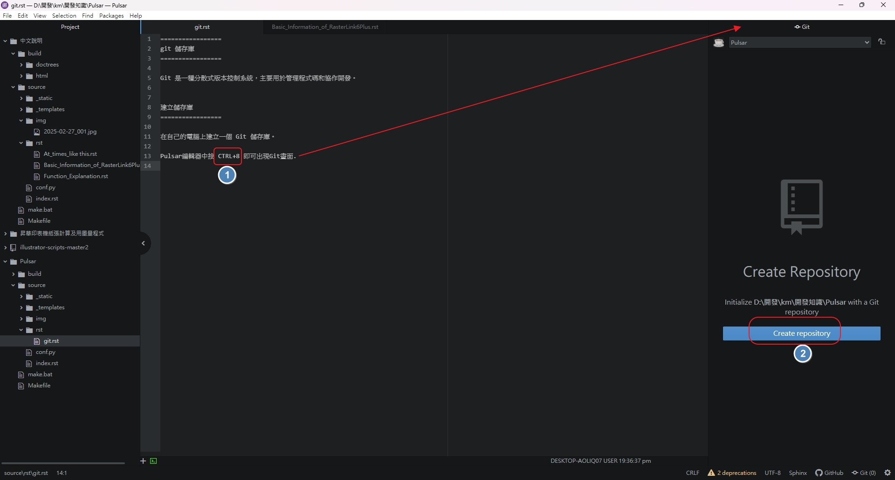
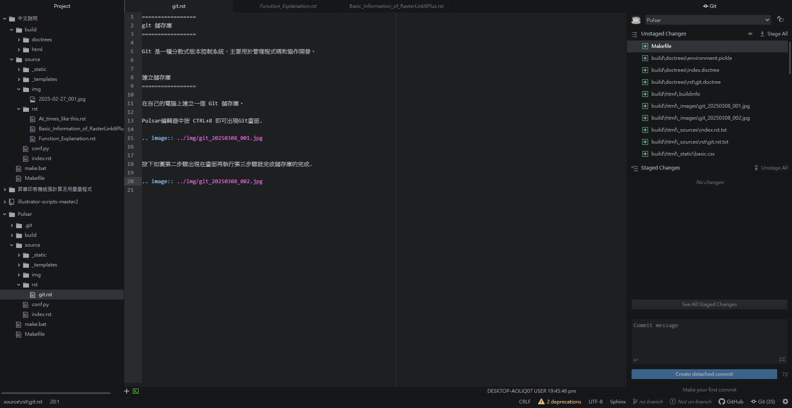
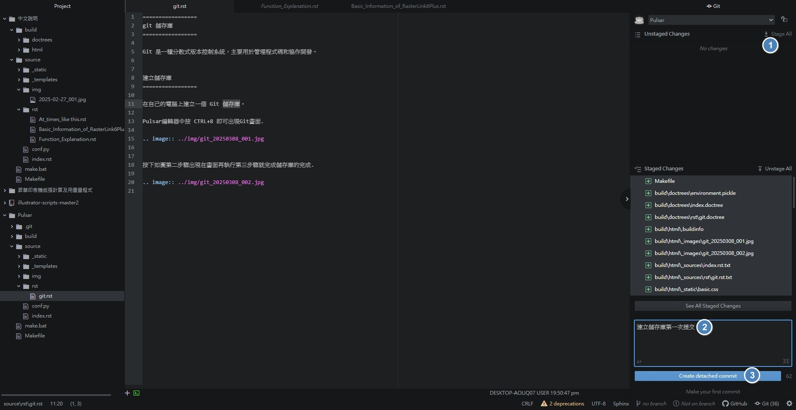
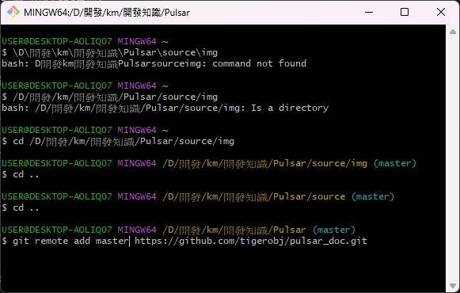

=================
git 儲存庫
=================

Git 是一種分散式版本控制系統，主要用於管理程式碼和協作開發。

建立儲存庫
=================

在自己的電腦上建立一個 Git 儲存庫。

Pulsar編輯器中按 CTRL+8 即可出現Git畫面.

按下如圖第二步驟出現在畫面再執行第三步驟就完成儲存庫的完成.

.. image:: ../img/git_20250308_002.jpg

.. image:: ../img/git_20250308_002.jpg

第一次提交

在 https://github.com/ 上建立遠耑儲存庫
使用 Git Bash 本地耑儲存庫與遠耑儲存庫聯結

git remote add master https://github.com/tigerobj/pulsar_doc.git

出了問題無法將檔案傳至遠瑞,執行下面即可

git push --set-upstream master master
